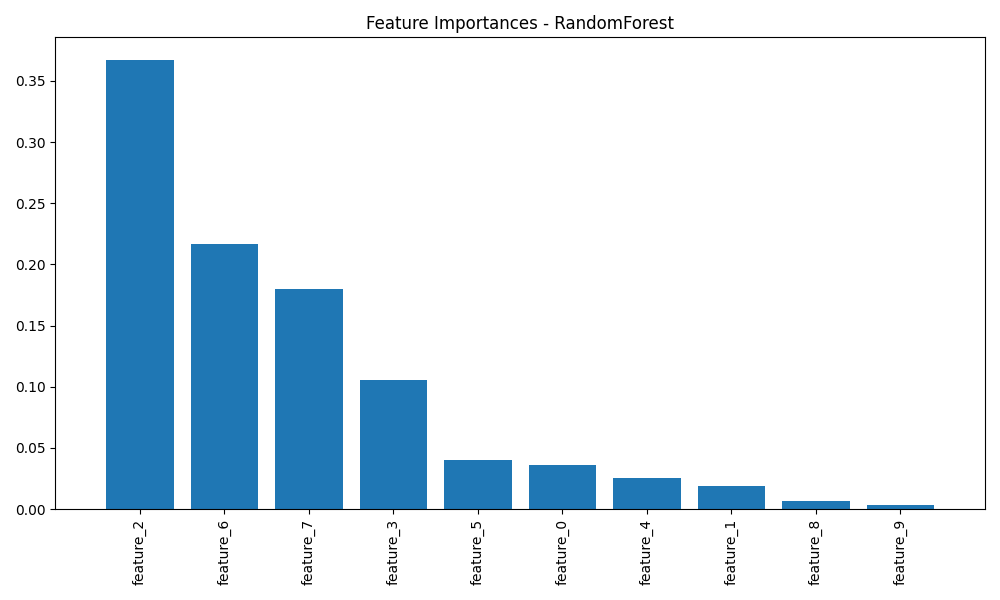

# ⚙️ TrainWise — Platform Latih Model ML Sendiri Secara Lokal

**TrainWise** adalah platform sederhana namun powerful untuk melatih model Machine Learning langsung dari komputer  tanpa perlu koneksi internet. Cocok buat eksperimen, riset pribadi, atau pembelajaran hands-on di bidang AI/ML.

---

## 🧠 Deskripsi Singkat

TrainWise memudahkan  dalam melakukan preprocessing data, memilih algoritma ML, melatih model, mengevaluasi performa, dan menyimpan hasilnya — semua dalam satu antarmuka interaktif. Dengan integrasi database PostgreSQL, setiap eksperimen tercatat dengan baik dan bisa dilacak kembali.

---

## 🚀 Fitur Utama Platform AutoML

Platform **TrainWise** dirancang untuk menyederhanakan proses machine learning secara end-to-end, dengan fokus utama pada klasifikasi data. Berikut fitur-fitur unggulannya:

### ⚙️ Preprocessing Data Otomatis
- Menangani nilai hilang menggunakan:
  - **Imputasi mean** untuk kolom numerik.
  - **Imputasi modus** untuk kolom kategorikal.
- Scaling fitur numerik menggunakan `StandardScaler`.
- Encoding fitur kategorikal dengan **One-Hot Encoding**.
- Semua transformasi disatukan dalam pipeline `ColumnTransformer` untuk efisiensi.

### 🤖 Pelatihan dan Evaluasi Model Serbaguna
- Mendukung model klasifikasi:  
  ✅ Decision Tree  
  ✅ Random Forest  
  ✅ Support Vector Machine (SVM)
- Hyperparameter dapat disesuaikan.
- Evaluasi model meliputi:  
  `Accuracy`, `Precision`, `Recall`, `F1-Score`, `ROC AUC`.

### 🗃️ Manajemen Eksperimen Terpusat
- Semua eksperimen dicatat ke **PostgreSQL** dengan metadata lengkap:
  - Nama eksperimen, dataset, target kolom.
  - Status (berjalan, selesai, gagal).
  - Timestamp mulai dan selesai.
  - Catatan tambahan.

### 🧠 Pencatatan & Pelacakan Model
- Setiap model yang dilatih dicatat dengan informasi berikut:
  - Nama model & path file.
  - Parameter pelatihan & waktu eksekusi.
  - Log file spesifik untuk model tersebut.

### 📊 Penyimpanan Metrik Kinerja
- Skor evaluasi **train & test set** tersimpan otomatis.
- Memungkinkan perbandingan kinerja antar eksperimen dan model.

### 📈 Visualisasi Hasil Otomatis
- Menyimpan hasil visualisasi seperti:
  - **Confusion Matrix** untuk mengevaluasi prediksi.
  - **Feature Importance** untuk model berbasis pohon (Decision Tree, Random Forest).

### 💾 Penyimpanan Artefak Model
- Model tersimpan dalam format `.joblib`:
  - Mudah di-reload untuk inference.
  - Memungkinkan reusabilitas model tanpa retraining.

### 📝 Sistem Logging Ekstensif
- Logging menyeluruh ke:
  - Konsol selama runtime.
  - File log terpisah untuk tiap eksperimen.
- Mempermudah debugging & pelacakan kesalahan.

---

## 🛠 Teknologi yang Digunakan

Platform ini dibangun dengan kombinasi teknologi Python dan sistem database relasional untuk memastikan kestabilan dan keterlacakan eksperimen:

| Teknologi | Keterangan |
|-----------|------------|
| **Python** | Bahasa pemrograman utama untuk seluruh platform. |
| **Scikit-learn** | Untuk preprocessing (`StandardScaler`, `OneHotEncoder`, `SimpleImputer`), pembuatan pipeline (`ColumnTransformer`), dan model ML (`RandomForestClassifier`, `DecisionTreeClassifier`, `SVC`). |
| **Pandas** | Manipulasi data dan loading file CSV ke dalam `DataFrame`. |
| **NumPy** | Operasi numerik dan pengelolaan array dengan performa tinggi. |
| **Matplotlib & Seaborn** | Visualisasi hasil eksperimen: Confusion Matrix dan Feature Importance. |
| **PostgreSQL** | Database relasional untuk menyimpan semua metadata eksperimen dan model. |
| **Psycopg2** | Adapter PostgreSQL untuk Python, mengelola koneksi dan query ke database. |
| **joblib** | Untuk menyimpan dan memuat ulang model yang sudah dilatih. |

---

## 📸 Hasil & Dokumentasi Visual

Berikut adalah beberapa hasil eksperimen dan visualisasi yang dihasilkan dari TrainWise:

### 🔍 Evaluasi Model (Confusion Matrix)

| Model | Gambar |
|-------|--------|
| Decision Tree (Exp 3) |  |
| Decision Tree (Exp 5) |  |
| Random Forest (Exp 3) |  |
| Random Forest (Exp 4) |  |
| Random Forest (Exp 7) |  |
| SVM (Exp 3) |  |
| SVM (Exp 6) |  |

---

### 🌲 Feature Importance (untuk model pohon)

| Model | Gambar |
|-------|--------|
| Decision Tree (Exp 3) |  |
| Decision Tree (Exp 5) |  |
| Random Forest (Exp 3) |  |
| Random Forest (Exp 4) |  |
| Random Forest (Exp 7) |  |

---
## 🧪 Tambahan: Semua Hasil Eksperimen

Berikut dokumentasi visual dari hasil-hasil eksperimen yang telah dilakukan:

| Judul Visualisasi   | Pratinjau |
|---------------------|-----------|
| Semua Eksperimen    |  |
| Eksperimen 1        |  |
| Eksperimen 2        |  |
| Eksperimen 3        |  |
| Eksperimen 4        |  |
| Eksperimen 5        |  |

---

Proyek ini dikembangkan oleh:

👤 **Christian J. Hutahaean**  

---
> “Build locally. Think globally.” — TrainWise
