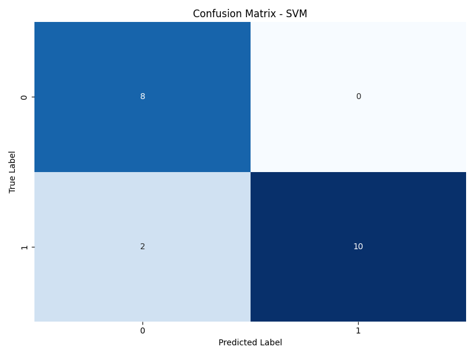
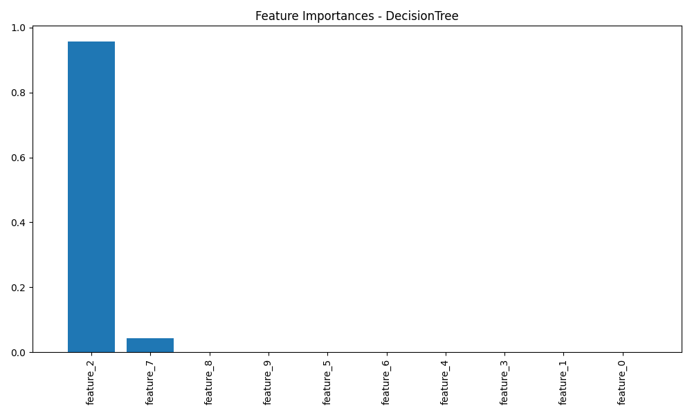
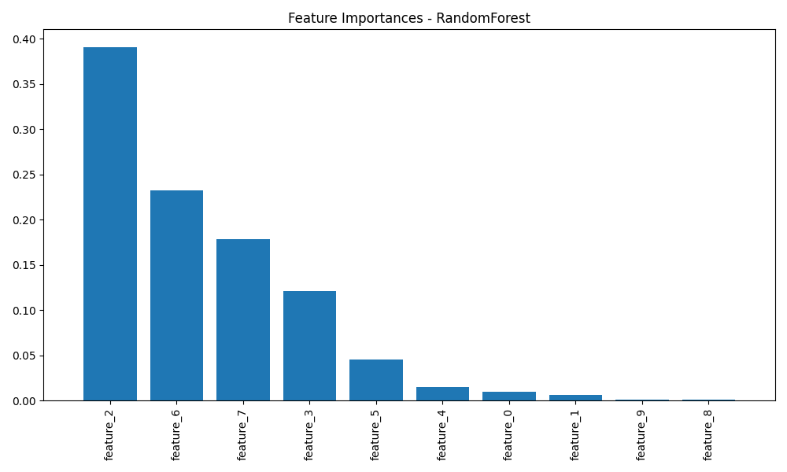

# ⚙️ TrainWise — Platform Latih Model ML Sendiri Secara Lokal

**TrainWise** adalah platform sederhana namun powerful untuk melatih model Machine Learning langsung dari komputer kamu tanpa perlu koneksi internet. Cocok buat eksperimen, riset pribadi, atau pembelajaran hands-on di bidang AI/ML.

---

## 🧠 Deskripsi Singkat

TrainWise memudahkan kamu dalam melakukan preprocessing data, memilih algoritma ML, melatih model, mengevaluasi performa, dan menyimpan hasilnya — semua dalam satu antarmuka interaktif. Dengan integrasi database PostgreSQL, setiap eksperimen tercatat dengan baik dan bisa dilacak kembali.

---

## 🔧 Fitur Utama

- ✅ Upload file CSV langsung dari lokal.
- 🧼 Auto-preprocessing data (handle missing value, encoding, dsb).
- 🤖 Dukungan algoritma: Decision Tree, Random Forest, dan SVM.
- 📊 Evaluasi otomatis (akurasi, precision, recall, F1-score).
- 📁 Simpan model jadi file `.pkl` untuk dipakai ulang.
- 🧠 Tracking semua eksperimen ke database PostgreSQL.
- 📈 Visualisasi hasil: confusion matrix & feature importance.

---

## 🛠 Teknologi yang Digunakan

- **Bahasa Pemrograman**: Python
- **Library ML & Analisis**:  
  `scikit-learn`, `pandas`, `numpy`, `matplotlib`, `seaborn`
- **Database**: PostgreSQL + `psycopg2`
- **Framework UI**: Streamlit

---

## 📸 Hasil & Dokumentasi Visual

Berikut adalah beberapa hasil eksperimen dan visualisasi yang dihasilkan dari TrainWise:

### 🔍 Evaluasi Model (Confusion Matrix)

| Model | Gambar |
|-------|--------|
| Decision Tree (Exp 3) |  |
| Decision Tree (Exp 5) |  |
| Random Forest (Exp 3) |  |
| Random Forest (Exp 4) |  |
| Random Forest (Exp 7) |  |
| SVM (Exp 3) |  |
| SVM (Exp 6) |  |

---

### 🌲 Feature Importance (untuk model pohon)

| Model | Gambar |
|-------|--------|
| Decision Tree (Exp 3) |  |
| Decision Tree (Exp 5) |  |
| Random Forest (Exp 3) |  |
| Random Forest (Exp 4) |  |
| Random Forest (Exp 7) |  |

---

## 🤝 Kontribusi & Kontak

Proyek ini dikembangkan oleh:

👤 **Christian J. Hutahaean**  
📫 christia006@gmail.com  
🌐 [LinkedIn](https://www.linkedin.com/in/christian-hutahaean)

Jika kamu tertarik untuk berkontribusi atau memiliki saran perbaikan, jangan ragu untuk menghubungi saya. Kontribusi terbuka untuk umum!

---

## 🧪 Tambahan: Semua Hasil Eksperimen

| Gambar Keseluruhan | |
|--------------------|--|
| Semua Eksperimen |  |
| Eksperimen 1 |  |
| Eksperimen 2 |  |
| Eksperimen 3 |  |
| Eksperimen 4 |  |
| Eksperimen 5 |  |

---

> “Build locally. Think globally.” — TrainWise
