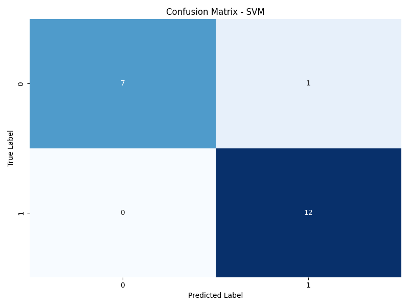

# ⚙️ **TrainWise — Platform Latih Model ML Sendiri Secara Lokal**

*Platform sederhana namun powerful untuk melatih model Machine Learning langsung dari komputer  
tanpa perlu koneksi internet. Cocok untuk eksperimen, riset pribadi, atau pembelajaran hands-on di bidang AI/ML.*

*Built with the tools and technologies:*

---
## 🔄 Alur Program 

Bagaimana sebenarnya TrainWise bekerja di balik layar? Di bawah ini adalah perjalanan lengkap sebuah eksperimen dari awal hingga akhir. Bayangkan ini seperti "dapur rahasia" sistem AutoML kamu — otomatis, rapi, dan bisa diandalkan.

---

### 🛠️ 1. Inisiasi & Persiapan

📁 Sebelum memulai eksperimen:
- Program memastikan struktur folder penting tersedia: `data/`, `models/`, dan `logs/`.
- Koneksi ke **PostgreSQL** dibuka dan tabel-tabel penting diverifikasi (atau dibuat otomatis).
  
> Semua siap!.

---

### 📝 2. Pencatatan Eksperimen Baru

📌 Setiap eksperimen diawali dengan mencatat:
- **Nama eksperimen**, **nama file dataset**, dan **target kolom** ke dalam tabel `experiments`.
- Status awal diatur menjadi `'running'`.

> Bayangkan aja seperti menulis resep baru di buku masak eksperimenmulah.

---

### 🧼 3. Pra-Pemrosesan Data Otomatis

📊 Begitu file CSV diunggah:
- Fitur **numerik dan kategorikal** dikenali otomatis.
- Dilakukan langkah preprocessing:
  - **Nilai hilang**? Diimputasi! (mean untuk numerik, modus untuk kategorikal).
  - **Numerik**? Di-scale dengan `StandardScaler`.
  - **Kategorikal**? Diubah ke angka lewat One-Hot Encoding.
- Split data ke **training dan testing** set.

> Data mentah diubah menjadi bahan siap masak untuk model machine learning.

---

### 🤖 4. Pelatihan & Evaluasi Model

Untuk setiap model yang dipilih:

#### ✅ Decision Tree  
#### 🌲 Random Forest  
#### 💠 Support Vector Machine (SVM)

Langkah-langkah yang dilakukan:

1. **Latih model** dengan data training.
2. **Simpan model** ke `.joblib` dan catat path-nya ke database.
3. **Evaluasi model**:
   - Gunakan metrik standar: Akurasi, Presisi, Recall, F1-Score, ROC AUC.
   - Hasil disimpan ke tabel `metrics`.
4. **Visualisasi otomatis**:
   - ✅ Confusion Matrix untuk melihat performa klasifikasi.
   - 🌟 Feature Importance (khusus model berbasis pohon).

> Satu per satu model diuji. Siapa yang tampil terbaik? Semua dicatat dengan rapi.

---

### ✅ 5. Penyelesaian & Penutupan

📌 Setelah semua model selesai:
- Status eksperimen diperbarui ke `'completed'`.
- Jika terjadi error saat proses, status otomatis berubah menjadi `'failed'` agar mudah dilacak.

🔒 Terakhir, koneksi ke database PostgreSQL ditutup.

> Seperti menutup buku resep setelah masakan siap disajikan.

---

## 🚀 Fitur Utama Platform AutoML

Platform **TrainWise** dirancang untuk menyederhanakan proses machine learning secara end-to-end, dengan fokus utama pada klasifikasi data. Berikut fitur-fitur unggulannya:

### ⚙️ Preprocessing Data Otomatis
- Menangani nilai hilang menggunakan:
  - **Imputasi mean** untuk kolom numerik.
  - **Imputasi modus** untuk kolom kategorikal.
- Scaling fitur numerik menggunakan `StandardScaler`.
- Encoding fitur kategorikal dengan **One-Hot Encoding**.
- Semua transformasi disatukan dalam pipeline `ColumnTransformer` untuk efisiensi.

### 🤖 Pelatihan dan Evaluasi Model Serbaguna
- Mendukung model klasifikasi:  
  ✅ Decision Tree  
  ✅ Random Forest  
  ✅ Support Vector Machine (SVM)
- Hyperparameter dapat disesuaikan.
- Evaluasi model meliputi:  
  `Accuracy`, `Precision`, `Recall`, `F1-Score`, `ROC AUC`.

### 🗃️ Manajemen Eksperimen Terpusat
- Semua eksperimen dicatat ke **PostgreSQL** dengan metadata lengkap:
  - Nama eksperimen, dataset, target kolom.
  - Status (berjalan, selesai, gagal).
  - Timestamp mulai dan selesai.
  - Catatan tambahan.

### 🧠 Pencatatan & Pelacakan Model
- Setiap model yang dilatih dicatat dengan informasi berikut:
  - Nama model & path file.
  - Parameter pelatihan & waktu eksekusi.
  - Log file spesifik untuk model tersebut.

### 📊 Penyimpanan Metrik Kinerja
- Skor evaluasi **train & test set** tersimpan otomatis.
- Memungkinkan perbandingan kinerja antar eksperimen dan model.

### 📈 Visualisasi Hasil Otomatis
- Menyimpan hasil visualisasi seperti:
  - **Confusion Matrix** untuk mengevaluasi prediksi.
  - **Feature Importance** untuk model berbasis pohon (Decision Tree, Random Forest).

### 💾 Penyimpanan Artefak Model
- Model tersimpan dalam format `.joblib`:
  - Mudah di-reload untuk inference.
  - Memungkinkan reusabilitas model tanpa retraining.

### 📝 Sistem Logging Ekstensif
- Logging menyeluruh ke:
  - Konsol selama runtime.
  - File log terpisah untuk tiap eksperimen.
- Mempermudah debugging & pelacakan kesalahan.

---

## 📸 Hasil & Dokumentasi Visual

Berikut adalah beberapa hasil eksperimen dan visualisasi yang dihasilkan dari TrainWise:

### 🔍 Evaluasi Model (Confusion Matrix)

| Model | Gambar |
|-------|--------|
| Decision Tree (Exp 3) |  |
| Decision Tree (Exp 5) |  |
| Random Forest (Exp 3) |  |
| Random Forest (Exp 4) |  |
| Random Forest (Exp 7) |  |
| SVM (Exp 3) |  |
| SVM (Exp 6) |  |

---

### 🌲 Feature Importance (untuk model pohon)

| Model | Gambar |
|-------|--------|
| Decision Tree (Exp 3) |  |
| Decision Tree (Exp 5) |  |
| Random Forest (Exp 3) |  |
| Random Forest (Exp 4) |  |
| Random Forest (Exp 7) |  |

---
## 🧪 Tambahan: Semua Hasil Eksperimen

Berikut dokumentasi visual dari hasil-hasil eksperimen yang telah dilakukan:

| Judul Visualisasi   | Pratinjau |
|---------------------|-----------|
| Semua Eksperimen    |  |
| Eksperimen 1        |  |
| Eksperimen 2        |  |
| Eksperimen 3        |  |
| Eksperimen 4        |  |
| Eksperimen 5        |  |

---

Proyek ini dikembangkan oleh:

👤 **Christian J. Hutahaean**  

---
> “Build locally. Think globally.” — TrainWise
